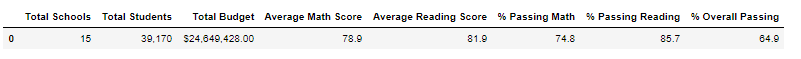
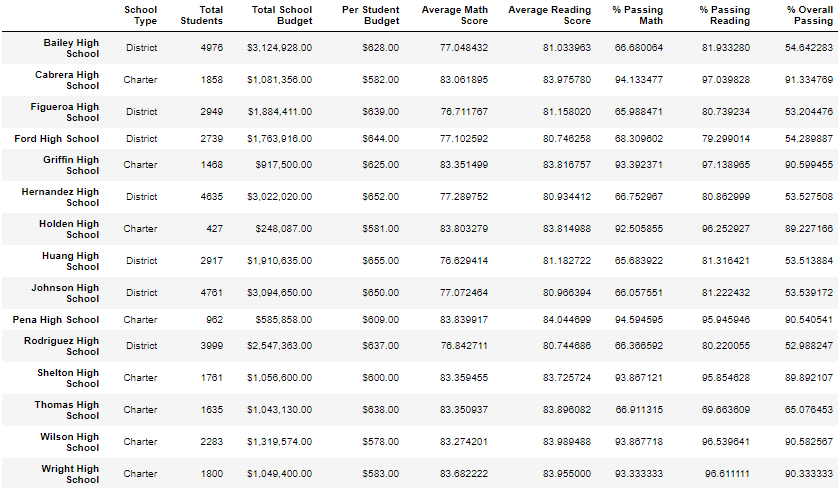
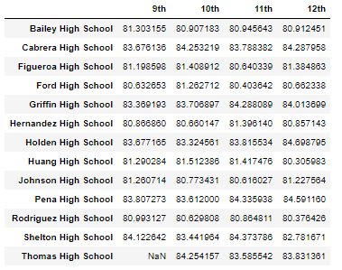
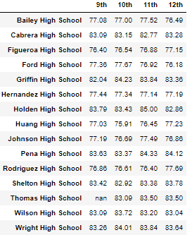
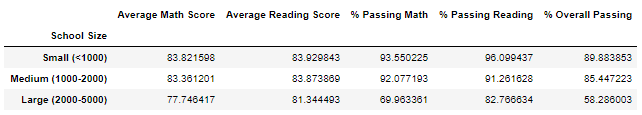
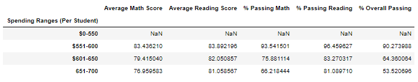
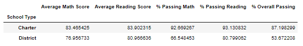

# **School_District_Analysis**

## **Overview of the Analysis:**

Because of suspected academic dishonesty a school board has hired your consulting firm to analyze student data.
the board requested to provide the following:
- The District summary
- The School summary
- Top 5 and bottom 5 performing schools, based on the overall passing rate
- The average math score for each grade level from each school
- The average reading score for each grade level from each school
- The scores by school spending per student, by school size, and by school type
- A report that summarizes your updated analysis

## **Results**

### **District Summary**

### **School summary**

### **Working with THS scores**

In oreder to start our analysis and to avoid the possibility of affecting any  further caluclation we have replaced ninth graders at the THS Math and Reading scores with
"NaN" which means Not a Number.

#### **THS Reading scores**

#### **THS Math scores**

### **Analysis by school size**

size ranges are as follows:  -small <1000      -medium 1000-2000       -large >2000

We noticed that both small and medium schools outperformed large school in overall passing rates.

### **Analysis by spending**

spending ranges are as follows:   -$0-$550      -$551-$600    -$601-$650     -$651-$700

we noticed that schools  that spends between $551 and $600 has out performed significantly all other schools when it comes to overall passing rates.

### **Analysis by school type**

school types are as follows:   -Charter    -District

we notice that Charter schools outperform district schools when it comes to overall passing rates.

## **Results**

* what happend when we removed ninh garders scores from THS to the school district:
  - did not affect AVG reading score.
  - AVG Math scores and overall passing rate were affected negatively however in a very limited way.

* Affects on THS:
  - percentage of students passing both Math and Reading dropped siginificantly.
  - Overall passing Percentage was affected negatively and significantly.

* Affects on school rankings:
  - THS is no longer on the top 5 high schools in th edistrict.
  - the Bottom 5 school sin the district were not affected.

* Scores by School size when removed 9th graderes from THS:
  - Affected Medium school size
  - Passing perentges for both reading and Math  went down.
  - Overall passing percentage dropped down .
 
 
 * Scores by school spending:
   - Affected the range between $601-$650
   - percentage passing for both Math and Reading dropped.
   - Overall passing percentage dropped.

 * Score by school type:
   - percentage passing for both Math and reading dropped slightly.
   - Overall passing percentage dropped.
  
  
 
 ## **Summary**
 
 we notice that Top 5 schools are all Charter schools while the bottom 5 schools are all District schools . After removing the ninth graders from THS we noticed some effects which some of them were significant while the others were slight and subtle.

